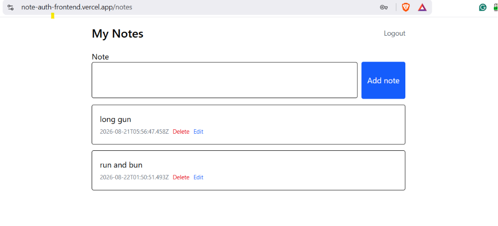

# Note Auth FrontEnd

You can register, log in, create notes, delete notes, and edit notes.

[Live Demo](https://note-auth-frontend.vercel.app)



## Features

- Create and store notes for the logged-in user.
- Delete your notes, create new notes, and edit existing notes.

## Tech Stack

Built with React and Tailwind CSS.

## What I Learned

I learned how modern websites work, from the front end to the back end.

## How to Run It Locally

```bash
git clone https://github.com/Anshuman56/note-auth-frontend
cd note-auth-frontend
npm install
create the .env file similar to .env.example
node server.js
```

## Backend code

https://github.com/Anshuman56/note-auth-api
